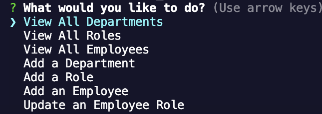

# Workforce Navigator 

## Description

This project is a content management system that allows users to view department, role, and employee information in the terminal. 

## Table of Contents

- [Installation](#installation)
- [Usage](#usage)

## Installation

First, clone the repository. Next, run `npm install` in your local IDE's terminal. Then, run `node index.js` to start the program. Select from the options that you are given to create, add to, and update the tables presented. 

## Usage

Choose from the seven options presented to either create a table, add to a table, or update a table.

    ```md
    
    ```

Check out a walkthrough video here: https://drive.google.com/file/d/1HTnl60bV3Ij7yozWs6mm43mtYE0ahCnJ/view?usp=sharing

## Badges


## Features

This Content Management System allows users to create tables that views departments, roles amd employees. It allows users to add departments, roles, employees, and update an employee role.

## How to Contribute

If you would like to contribute, send me a message in GitHub: https://github.com/Kiararj